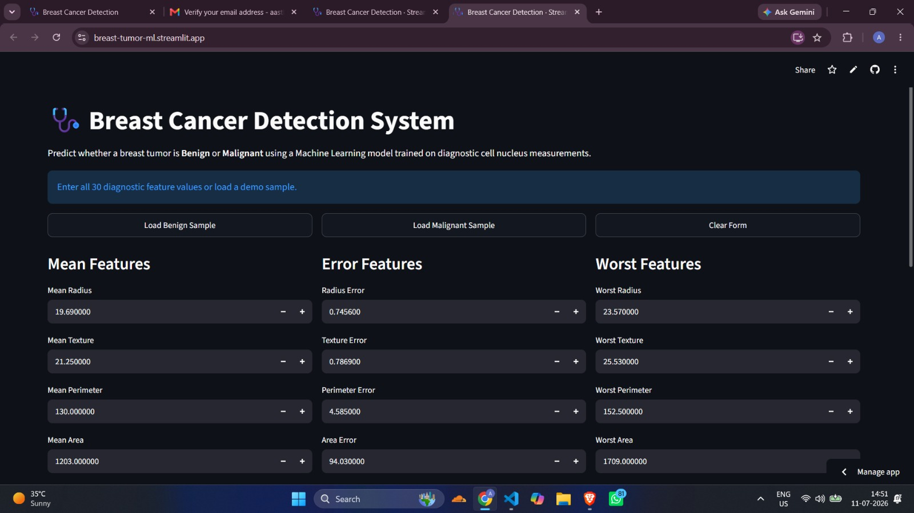
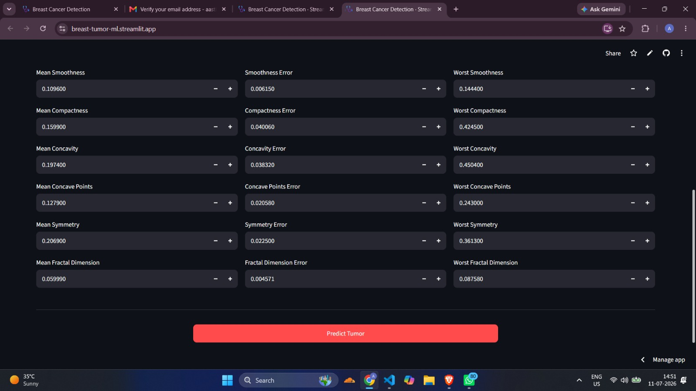
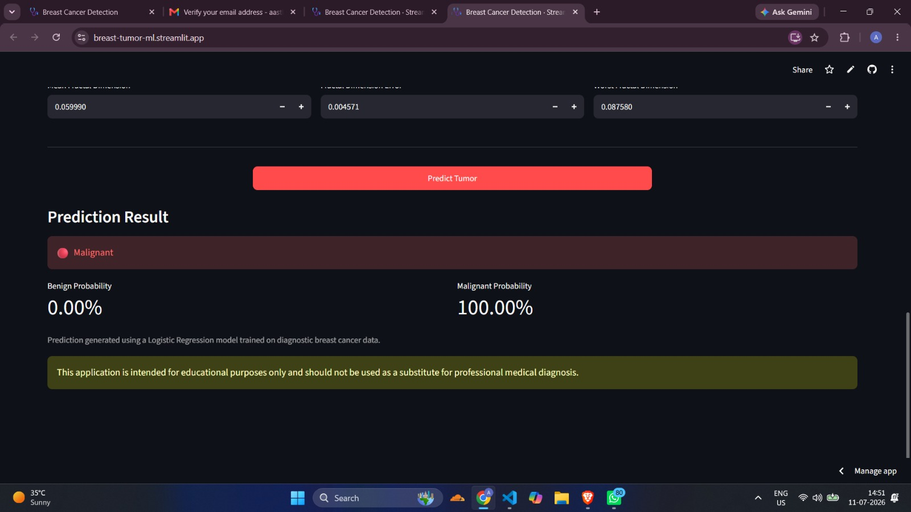
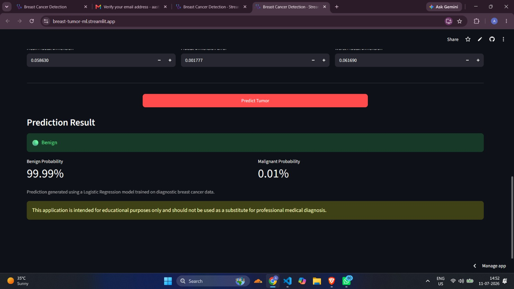

# Breast Cancer Prediction ML

A Machine Learning web application that predicts whether a breast tumor is **Benign** or **Malignant** using diagnostic cell nucleus measurements.

The project implements a complete Machine Learning workflow including data preprocessing, feature scaling, model training, evaluation, prediction, web application development, and cloud deployment.

## Live Demo

The deployed Streamlit application is publicly available online.

**Live Application:** https://breast-tumor-ml.streamlit.app

## Project Overview

The system uses 30 diagnostic input features describing characteristics of cell nuclei.

The features are divided into three categories:

- Mean Features
- Error Features
- Worst Features

A trained Logistic Regression model processes these measurements and predicts whether the tumor is:

- Benign
- Malignant

The application also displays prediction probabilities for both classes.

## Features

- Machine Learning based tumor classification
- 30 diagnostic feature inputs
- Benign and Malignant prediction
- Prediction probability display
- Random benign demo samples
- Random malignant demo samples
- Clear form functionality
- Interactive Streamlit interface
- Feature scaling using StandardScaler
- Cloud deployed application

## Machine Learning Workflow

1. Load the breast cancer dataset
2. Separate input features and target variable
3. Split the dataset into training and testing sets
4. Apply feature scaling using StandardScaler
5. Train a Logistic Regression model
6. Evaluate the trained model
7. Save the trained model and scaler
8. Load the saved model for predictions
9. Integrate the trained model with the web application
10. Deploy the application using Streamlit Community Cloud

## Model Performance

The Logistic Regression model achieved an accuracy of:

**99.12%**

### Confusion Matrix

| Actual / Predicted | Malignant | Benign |
|---|---:|---:|
| Malignant | 42 | 1 |
| Benign | 0 | 71 |

The model was evaluated using:

- Accuracy
- Precision
- Recall
- F1-Score
- Confusion Matrix
- Classification Report

## Tech Stack

### Machine Learning

- Python
- Scikit-learn
- Pandas
- NumPy
- Joblib

### Data Analysis and Visualization

- Matplotlib
- Seaborn
- Jupyter Notebook

### Web Development

- Streamlit
- Flask
- HTML
- CSS
- JavaScript

### Deployment and Version Control

- Streamlit Community Cloud
- Git
- GitHub

## Project Structure

```text
Breast-Cancer-Prediction-ML/
│
├── data/
│   └── raw/
│       └── breast_cancer.csv
│
├── models/
│   ├── model.pkl
│   └── scaler.pkl
│
├── notebooks/
│   ├── eda.ipynb
│   └── 03_model_evaluation.ipynb
│
├── src/
│   ├── preprocess.py
│   ├── train.py
│   └── predict.py
│
├── static/
│   └── style/
│       └── style.css
│
├── templates/
│   └── index.html
│
├── app.py
├── streamlit_app.py
├── demo.js
├── requirements.txt
├── .gitignore
└── README.md
```

## Input Features

The model uses 30 diagnostic features divided into three groups.

### Mean Features

- Mean Radius
- Mean Texture
- Mean Perimeter
- Mean Area
- Mean Smoothness
- Mean Compactness
- Mean Concavity
- Mean Concave Points
- Mean Symmetry
- Mean Fractal Dimension

### Error Features

- Radius Error
- Texture Error
- Perimeter Error
- Area Error
- Smoothness Error
- Compactness Error
- Concavity Error
- Concave Points Error
- Symmetry Error
- Fractal Dimension Error

### Worst Features

- Worst Radius
- Worst Texture
- Worst Perimeter
- Worst Area
- Worst Smoothness
- Worst Compactness
- Worst Concavity
- Worst Concave Points
- Worst Symmetry
- Worst Fractal Dimension

## Running the Project Locally

Clone the repository and navigate to the project directory.

Create and activate a Python virtual environment.

Install the required dependencies:

```bash
pip install -r requirements.txt
```

Run the Streamlit application:

```bash
streamlit run streamlit_app.py
```

The application will open in your browser.

## Deployment

The application is deployed using Streamlit Community Cloud.

The deployment uses:

- GitHub repository as the source code
- `main` branch
- `streamlit_app.py` as the application entry point
- `requirements.txt` for dependency installation

The deployed application is available at:

https://breast-tumor-ml.streamlit.app

## Screenshots

### Application Interface





### Prediction Result





## Disclaimer

This application is intended for educational and Machine Learning demonstration purposes only.

It should not be used as a substitute for professional medical diagnosis or clinical decision-making.

## Author

**Aastha Shukla**

B.Tech Computer Science and Engineering  
Machine Learning and Software Development Enthusiast

## Project Status

**Version 1.0 - Deployed**